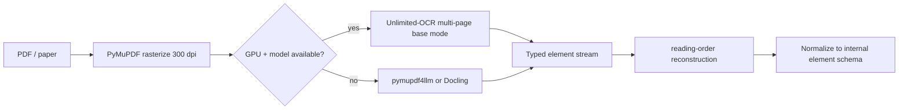
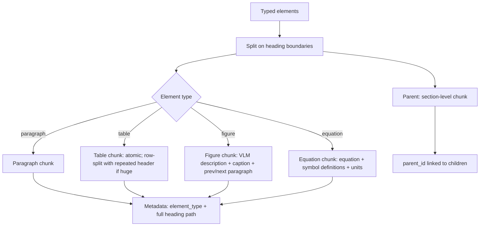
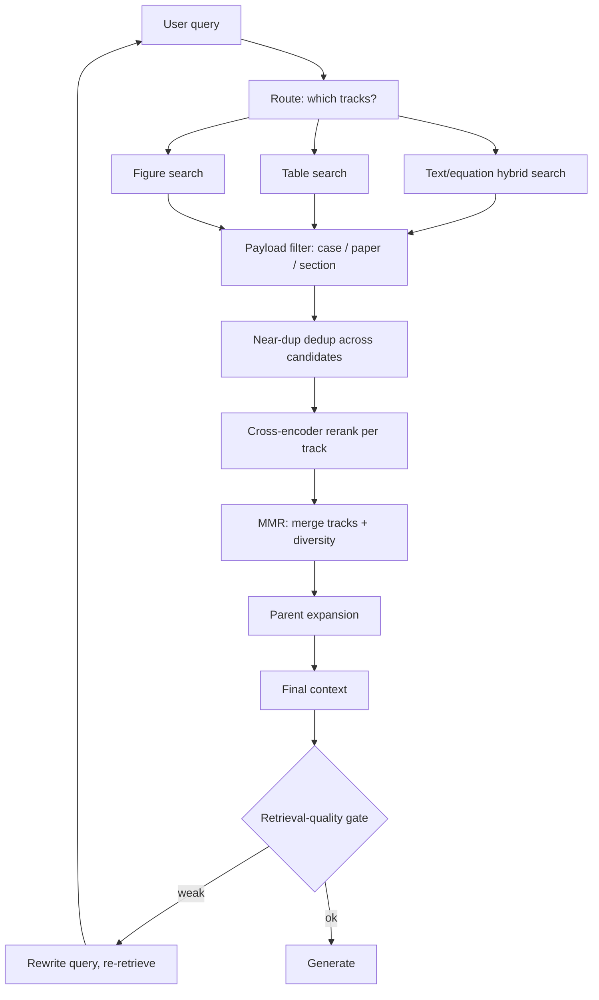
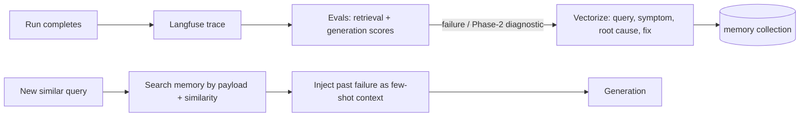
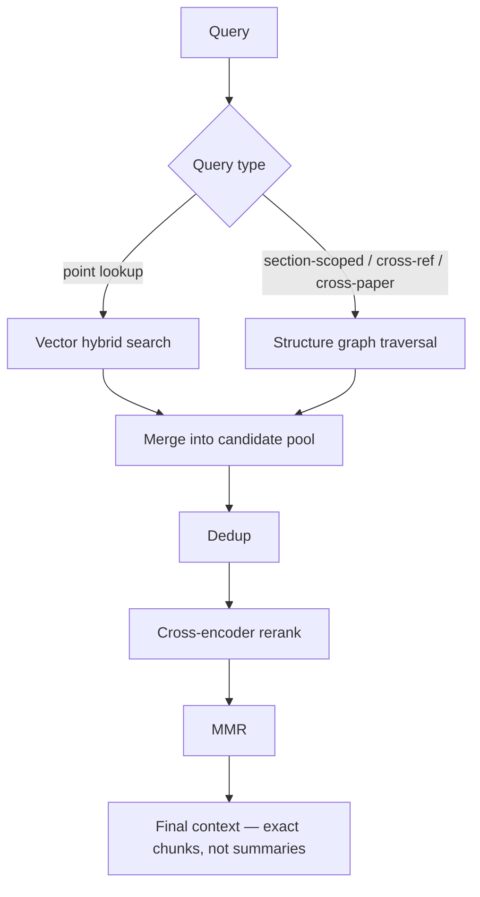

# Agent 1 RAG v2 — Proposed Architecture (Design Notes)

Status: **Design draft** — parser choice intentionally left open (Unlimited-OCR is a candidate, not a dependency).

Scope: Upgrade the thesis Agent 1 retrieval-augmented reasoning framework from its current form
(ChromaDB, dense+BM25, cross-encoder rerank, equation inventory, adaptive retrieval) to a robust,
multimodal, self-improving scientific RAG. Everything here composes with the thesis's existing
verification/critique/audit safeguards.

---

## 1. Design goals

1. **Parser-agnostic front end.** A layout-aware parse (Unlimited-OCR when GPU is available, pymupdf4llm/Docling fallback) that yields **typed elements with bounding boxes and reading order**.
2. **Structure-preserving chunks.** Tables atomic (header repeated on split), captions attached to figures, equations kept with their symbol definitions, heading path in every chunk's metadata.
3. **Multimodal retrieval tracks.** Text, table, figure-description, and equation tracks merged at query time — not just prose.
4. **Payload-filtered multi-tenant store.** Corpus + episodic memory in the same vector DB, isolated by payload fields (client/case/run/paper), exactly as the review report's enterprise-Qdrant recommendation.
5. **Co-primary deterministic structure graph.** The corpus's main workload is *linking multiple research papers* (who cites whom, which chunks use which equations, section scoping). The graph's edges are **parsed, never LLM-generated** — heading hierarchy, parent–child chunk relations, cross-references, and bibliography citations are all deterministic. The LLM interprets *queries*, not the store. Vector search stays primary for point/entity lookups; graph traversal handles structure and cross-paper queries.
6. **Robust, non-redundant retrieval.** Adaptive retrieval + retrieval-quality gate (Self-RAG/CRAG style), candidate-pool near-dup dedup, and MMR diversity on the final context.
7. **Episodic memory.** Phase-2 errors and Langfuse-traced failures vectorized and reused as few-shot context on similar future runs.
8. **Benchmarked.** Retrieval (Recall@K, MRR, nDCG@K, Hit@K) + generation (RAGAS) evals on a labeled query→chunk gold set (ERCOFTAC T3A/T3B, KTH flat plate), traced through Langfuse.

---

## 2. High-level architecture

```mermaid
flowchart TD
    subgraph INGEST ["INGEST & PARSE"]
        PDF[PDF / scanned paper] --> RAST[Rasterize 300 dpi]
        RAST --> PARSER{Layout-aware parser}
        PARSER -->|GPU available| UOCR[Unlimited-OCR / DeepSeek-OCR]
        PARSER -->|CPU / fallback| PMLLM[pymupdf4llm / Docling]
        UOCR --> TYPED[Typed elements + bbox + reading order]
        PMLLM --> TYPED
    end

    subgraph CHUNK ["CHUNKING"]
        TYPED --> SEC[Section split by heading]
        SEC --> CHILDREN[Child chunks: paragraph / table / figure / equation]
        CHILDREN -->|attach caption + context| FIG[Figure chunks: VLM description + caption + surrounding text]
        SEC --> PARENT[Parent section chunks]
        CHILDREN --> META[Metadata: element_type, heading_path, paper_id, page, bbox, fig/table no.]
    end

    subgraph INDEX ["INDEXING (Qdrant)"]
        META --> TEXTIDX[(Text track)]
        META --> TABLEIDX[(Table track: Markdown-serialized)]
        META --> FIGIDX[(Figure track: description embeddings)]
        META --> EQIDX[(Equation track)]
        PARENT --> PARIDX[(Parent sections)]
        FIGIMG[(Image files / object store)] -.path in payload.-> FIGIDX
    end

    subgraph GRAPH ["DOCUMENT STRUCTURE GRAPH (deterministic, LLM-free)"]
        TYPED --> SECND[Section/subsection nodes from heading hierarchy]
        CHILDREN --> CHNODES[Chunk nodes = children, parent_id → section node]
        PARENT --> PARND[Parent/section nodes]
        TYPED --> XREF[Cross-reference edges: "see Eq. (3.6)", "Fig 4.2", "per [16]"]
        CIT[(Citation edges: paper → cites → paper, parsed from bibliographies)]
        SECND --> KG[(Neo4j / graph store)]
        CHNODES --> KG
        PARND --> KG
        XREF --> KG
        CIT --> KG
    end

    subgraph MEMORY ["EPISODIC MEMORY"]
        TRACES[(Langfuse traces)]
        ERR[(Phase-2 errors + diagnostics)]
        TRACES --> MEMVEC[(Memory track: vectorized failures)]
        ERR --> MEMVEC
    end

    subgraph QUERY ["RETRIEVAL"]
        Q[User query] --> ROUTE[Query router: text / table / figure / equation / graph]
        ROUTE --> HYB[Hybrid search: dense + BM25]
        HYB --> FILTER[Payload filter: case / paper / section / element_type]
        FILTER --> POOL[Candidate pool 20–50]
        ROUTE -->|structure / cross-paper| GTRAV[Graph traversal: section scoping, cross-ref hops, citation hops]
        GTRAV --> GPOOL[Graph evidence: exact chunk text from deterministic nodes]
        GPOOL --> POOL
        POOL --> DEDUP[Near-dup dedup on pool]
        DEDUP --> RERANK[Cross-encoder rerank]
        RERANK --> MMR[MMR diversity selection]
        MMR --> EXPAND[Parent expansion small-to-big]
        EXPAND --> CTX[Final context]
        MEMVEC -->|few-shot past failures| CTX
    end

    subgraph GEN ["GENERATION & GUARDRAILS"]
        CTX --> LLM[LLM reasoning (ReAct-style, tool-assisted)]
        LLM --> VERIF[Formula verification + source check]
        LLM --> CRIT[Critique / retrieval-quality gate]
        CRIT -->|insufficient| REQ[Rewrite query + re-retrieve]
        REQ --> QUERY
        CRIT -->|ok| OUT[Answer + audit trail]
    end

    subgraph EVAL ["EVALUATION & LEARNING"]
        OUT --> LANGFUSE[Langfuse trace]
        LANGFUSE --> EVALR[Retrieval: Recall@K / MRR / nDCG@K]
        LANGFUSE --> EVALG[Generation: RAGAS faithfulness / relevancy]
        EVALR -->|failures| ERR
        EVALG -->|failures| ERR
    end

    INGEST --> CHUNK --> INDEX
    INGEST --> GRAPH
    GRAPH --> QUERY
    INDEX --> QUERY
    QUERY --> GEN
    GEN --> EVAL
```

---

## 3. Ingestion / parsing cascade (parser-agnostic)



Design decisions:

- **Unlimited-OCR** (or DeepSeek-OCR) is the *preferred* parser when a GPU is present: one-shot long-horizon parsing, emits `<|det|>type [bbox]` markers so elements arrive typed and boxed with reading order. Strongest on tables/figures/math.
- **pymupdf4llm / Docling** is the CPU fallback; Docling gives typed elements, pymupdf4llm gives reading-order Markdown. Keep the thesis's existing fallback-cascade philosophy.
- The pipeline only ever consumes the **internal element schema** (below), so swapping parsers later does not touch the chunking/retrieval code.

### 3.1 Internal element schema

| Field | Type | Notes |
|---|---|---|
| `element_id` | uuid | unique per element |
| `element_type` | enum | `heading / paragraph / table / figure / equation / caption / footnote` |
| `paper_id` | str | source paper |
| `page` | int | page number |
| `section_path` | str | e.g. `"2.3.2 Test Configuration"` |
| `heading_level` | int | depth of heading |
| `bbox` | [x0,y0,x1,y1] | page coordinates |
| `reading_order` | int | global order |
| `text` | str | text or serialized content |
| `table_structure` | optional | rows/columns, header row |
| `figure_ref` | optional | figure number, image path |
| `caption` | optional | attached caption text |
| `equation_ref` | optional | equation number |

---

## 4. Chunking rules



Rules:

1. **Never split a table**; if oversized, split at row boundaries and repeat the header row in every child chunk. Serialize as Markdown (preserves structure) for both embedding and LLM context.
2. **Figure chunk = VLM-generated description + caption + one paragraph before + one after.** This is the retrieval surface for "show me the C_f plot." The image file lives in object storage; its path is payload metadata.
3. **Equation chunk = equation + its symbol table + units + the defining paragraph.** Never separate an equation from its definitions (this is what prevented the thesis's degenerate-correlation failure mode).
4. **Parent–child small-to-big.** Retrieve precise child chunks, expand to the section-level parent for generation context.
5. **Exact-hash + near-dup dedup at ingest.** Normalize text (strip metadata header, lowercase, collapse whitespace), hash for exact dupes; embedding-cosine ≥ 0.95 (or MinHash) for near-dups. Keep the occurrence with the most context; drop or set `duplicate_of` pointer on the rest.

---

## 5. Vector DB layout (Qdrant) with payload filtering

One instance, multiple collections (or one collection with a `track` payload field — filtered at query time):

| Collection | Content | Vector dim | Payload filters |
|---|---|---|---|
| `text` | paragraph/equation chunks | embedding | `paper_id, section_path, element_type, client_id, case_id` |
| `table` | Markdown-serialized tables | embedding | same + `table_no` |
| `figure` | figure descriptions | embedding | same + `figure_no, image_path` |
| `parent` | section-level chunks | embedding | `paper_id, section_path, level` |
| `memory` | Phase-2 errors + trace failures | embedding | `run_id, case_id, symptom_type, resolved?` |

- **Payload filtering** is applied *before* vector search (Qdrant `must` clauses on payload + similarity in one query) — this is what isolates tenants/cases and scopes retrieval to a paper or section.
- **Every chunk's payload carries the full heading path** so the model always knows "this is from §2.3.2 Test Configuration."

---

## 6. Retrieval pipeline (per query)



### 6.1 Query routing

A cheap classifier (or lightweight LLM) tags the query:

- "Where does transition start per Fransson?" → equation/text tracks, weight table low
- "Show the C_f plot" → figure track
- "Compare the two RANS models' onset" → text + table

Track weights shape the candidate pool before rerank.

### 6.2 Diversity & redundancy control

1. **Pool-level near-dup dedup** — after hybrid search, drop near-identical candidates before reranking (the 20–50 pool often contains the same passage from different papers' intros).
2. **MMR** on the reranked list:

   `score(c) = λ · relevance(c) − (1−λ) · max_{s ∈ selected} sim(c, s)`,  λ ≈ 0.7–0.8

   Prevents "three chunks saying the same thing with different wording" from filling the context window. (Evidence: diversity measurably improves LLM recall — arXiv 2502.09017.)

### 6.3 Robustness loop (Self-RAG / Corrective-RAG style)

- **Retrieval-quality gate** after MMR: an LLM judges whether the selected chunks actually answer the query.
- If **insufficient** → rewrite the query (add synonyms, swap Tu/Reynolds conventions, cite the equation name) and re-retrieve, up to a budget.
- If **irrelevant despite retrieval** → consult the episodic memory track for past similar failures before answering "not found."
- This rides on the thesis's existing critique + coverage-verification + source-check stages — it adds the *retrieval-level* critique the current design lacks.

---

## 7. Episodic memory & Langfuse traces



- **Corpus and traces are stored in the same vector DB** (different collections), exactly as the review report recommends — "episodic memory."
- A Phase-2 error like "Λ_x = 39.4 mm outside correlation band → theory under-predicted" becomes a retrievable memory row: `{symptom_type: length_scale_mismatch, case: Tu=2.7%, root_cause, fix}`.
- Retrieval of memories is **payload-filtered** (same `case_id`, same `symptom_type`) so memories from other cases never leak in.
- Langfuse traces are the *source* of these memories; the vector DB is the *retrieval store* for them.

---

## 8. Document structure graph (deterministic, LLM-free)

**The core insight (from review):** classic GraphRAG (and LightRAG) force an LLM to *interpret and summarize* the corpus **at index time** — entity extraction, relation extraction, community summaries. Every one of those LLM passes is a hallucination surface *before a single query is asked*. For a thesis whose entire credibility rests on **traceability and auditability of every claim**, injecting LLM-generated edges into the store is a liability, not a feature.

**The alternative: the LLM never invents structure. The structure is the document's own.** Headings, section hierarchy, parent→child chunk relations, cross-references ("see Eq. (3.6)", "Fig 4.2", "per [16]"), and citation links are all *deterministic* — they come from the parser, not a model. The graph's nodes are the *exact chunks* already stored in the vector DB (so no content duplication), and its edges are *structural facts*, not LLM judgments.

This pattern is known as **deterministic document-structure-based retrieval** (WhyHow.AI, 2024): represent section/subsection hierarchies as a graph, tie chunk IDs to that structure, and let retrieval traverse *rules* ("answer Liquidity Events questions only from the Liquidity Event section") instead of asking an LLM to pre-summarize meaning.

### 8.1 Why this beats entity/relation GraphRAG for *this* corpus

| | LLM entity/relation graph (GraphRAG, LightRAG) | **Deterministic structure graph (chosen)** |
|---|---|---|
| Index-time LLM passes | Yes — entity + relation extraction per chunk, community summaries | **None** — edges are parsed, not generated |
| Hallucination surface at index | Every extraction pass | **Zero** — the parser doesn't interpret, it records |
| Node content | LLM-summarized entities | **Exact chunk text** (same chunks as the vector DB) |
| Auditability | Edges must be re-verified to trust them | Edges are mechanical; trivially reproducible |
| Cross-paper linking | Requires the LLM to correctly extract "AGS relates to Mayle" | **Citation edges from bibliographies** — explicit, verifiable |
| Fit to thesis | Violates the traceability requirement | **Matches it** — structure is evidence, not opinion |

The one thing entity graphs *can* do that structure graphs can't is synthesize brand-new relationships the text never states ("this correlation contradicts that one"). But for the thesis, those inferences belong at **query time** (in the A6 cross-validation stage, grounded in retrieved chunks), never baked into the store.

### 8.2 Graph construction (deterministic)

```mermaid
flowchart LR
    PARSED[Typed elements from ingest] --> H[Sections/sub-sections: heading hierarchy]
    PARSED --> C[Chunk nodes: exact chunk text + chunk_id]
    PARSED --> X[Cross-references: "see Eq. 3.6" / "Fig 4.2" / "per [16]" via regex]
    BIB[PDF bibliographies] --> CIT[Citation edges: paper → cites → paper]
    H --> KG[(Neo4j / graph store)]
    C --> KG
    X --> KG
    CIT --> KG
    KG --> VECS[Chunk embeddings already in Qdrant — graph references, doesn't duplicate]
```

Node types (all deterministic):
- **Section / subsection nodes** (heading text, level, paper_id)
- **Chunk nodes** (chunk_id → exact text in Qdrant, element_type, heading_path)
- **Paper nodes** (from citation parsing)

Edge types (all parsed, none generated):
- `contains` (section → child section / chunk) — from the heading hierarchy and parent–child chunking
- `cites` (paper → paper) — from bibliography parsing
- `refers_to` (chunk → figure/table/equation within the same paper) — from regex cross-reference extraction ("see Eq. (3.6)", "Fig 4.2", "per [16]")

This is essentially the thesis's existing **equation inventory** generalized to a full structural graph: the inventory already stores paper_id, equation id, page, symbol; the graph adds the *relations* (which section contains it, which chunks refer to it, which papers cite the paper).

### 8.3 Retrieval: structure + vector hybrid



- **Point lookups** ("AGS onset for Tu=2.7%") → vector track, as today.
- **Section-scoped queries** ("what does §2.3.2 say") → graph: locate the section node, pull its contained chunks.
- **Cross-reference hops** ("which chunks use Eq. (3.6)?") → graph: follow `refers_to` edges in reverse; gives the FS20-usage chunks exactly.
- **Cross-paper queries** ("who cites Fransson–Shahinfar 2020?") → graph: `cites` edges from bibliography parsing — a one-hop traversal that the vector track cannot express.
- **Vector-first + graph expansion** as the default middle path: vector search returns seed hits, graph expansion pulls the citation neighborhood (cited papers, citing papers) into the pool before rerank.
- **Episodic memory links in**: a Phase-2 "length_scale_mismatch" memory is a node — a new query on similar flow conditions traverses to past failures of the same type.

### 8.4 What the LLM still does (and where)

The LLM's job moves entirely to **query time**, which is where its risk is manageable:

1. **Interpret the query** (route: point vs section vs cross-paper).
2. **Reason over retrieved chunks** (exact text, already traceable).
3. **Optionally propose cross-paper *inferences*** ("the two correlations disagree on Λ_x") — *after* retrieval, grounded in cited chunks, and routed through the existing critique/verification gates. These inferences are never written back into the graph unless a human (or the Phase-2 pipeline) validates them.

This keeps the graph **append-only and human-auditable**: nothing in the store was generated by an LLM.

### 8.5 Costs & risks (honest)

- **Indexing cost**: near-zero relative to GraphRAG — no LLM passes at index. Regex cross-reference extraction and bibliography parsing are cheap and deterministic.
- **Cross-reference extraction quality**: regex-based "see Eq. (x)"/"Fig y"/"per [n]" extraction is imperfect (misses prose references). Mitigate by (a) using the parsed equation/figure inventory as anchors, (b) accepting a recall < 1 — the vector track still covers what the graph misses, so the graph's job is *precision*, not recall.
- **Graph drift**: append-only per paper version; rebuilding is mechanical and reproducible — no LLM nondeterminism.
- **Verdict**: the graph is co-primary **for structure and cross-paper queries**, and it is *deterministic* — the vector track carries semantic similarity, the graph carries the document's own structure, and the LLM carries reasoning. No layer generates the store.

---

## 9. Evaluation & benchmarking

### 9.1 Gold set

- **Domain anchors**: ERCOFTAC T3A/T3B, KTH flat-plate datasets (already cited in the thesis as the standard transition benchmarks).
- **Labeled query→chunk pairs**: e.g. `"AGS onset for Tu=2.7% ZPG"` → `{AGS chunk, Blasius inversion chunk}`; `"k-kl-omega model equations"` → `{Walters-Cokljat chunk}`.
- Store as a JSONL evalset; run offline when chunking/parsing/models change (the CI/CD idea from the review report).

### 9.2 Metrics

| Layer | Metrics |
|---|---|
| Retrieval | Recall@K, MRR, nDCG@K, Hit@K |
| Graph | traversal path accuracy, cross-reference edge precision/recall, citation coverage |
| Generation | RAGAS: faithfulness, answer relevancy, context precision, context recall |
| Robustness | retrieval-failure rate (gate triggered), re-query rate |

### 9.3 Langfuse

- Trace every stage: query routing → track weights → pool size → dedup count → rerank scores → MMR λ → gate verdict → final answer.
- Attach RAGAS scores as trace annotations; failures feed the episodic-memory collection (section 7).

---

## 10. Open decisions

1. **Parser**: Unlimited-OCR (GPU, strongest) vs pymupdf4llm/Docling (CPU, sufficient). Architecture is parser-agnostic — decide by hardware.
2. **Embedding model**: current thesis uses NVIDIA Llama-Embed-Nemotron-8B; evaluate against BGE-small/ColBERT-style for table/figure tracks.
3. **Figure track depth**: VLM descriptions only (cheap, sufficient) vs ColPali page embeddings (strongest, heavy). Descriptions recommended first.
4. **Vector DB**: Chroma (current) vs Qdrant (review report's recommendation; payload filtering + scaling). Qdrant recommended once corpus + memory + multi-tenant needs land.
5. **Graph store**: Neo4j (recommended: native graph, Cypher, vector index built-in) vs Qdrant-as-graph (workable for small graphs, one less dependency). Decide after prototyping the structure schema.
6. **Graph engine**: none needed — the structure graph is deterministic (no LightRAG/GraphRAG dependency). Revisit LLM entity graphs *only* as a query-time, non-persisted enrichment if synthesis queries ever demand it.
7. **MMR λ**: tune 0.6–0.85 on the gold set, not guessed.
8. **Memory write policy**: only high-confidence confirmed failures (Phase-2 verdicts), to avoid polluting memory with noise.
9. **Cross-paper gold set**: build labeled multi-hop queries ("who cites Fransson–Shahinfar 2020?", "which chunks use Eq. (3.6)?") to measure the structure graph's added value against vector-only baselines.

---

## 11. Suggested build order (when implementation starts)

1. Internal element schema + parser adapters (Unlimited-OCR + pymupdf4llm fallback)
2. Section-aware chunker with parent–child + heading metadata
3. Table/figure/equation chunk rules + VLM description generation
4. Qdrant collections + payload filtering + hybrid search
5. Pool dedup + MMR
6. Retrieval-quality gate + re-query loop
7. **Structure graph: section hierarchy + chunk nodes + parent–child edges + Neo4j ingest (all deterministic)**
8. **Citation graph: bibliography parsing → paper nodes + `cites` edges**
9. **Cross-reference edges: regex "see Eq./Fig/per [n]" extraction tied to the equation/figure inventory**
10. **Query router: point lookup → vector, section/cross-ref/cross-paper → graph, default → vector-first + graph expansion**
11. Langfuse tracing + RAGAS evals + gold set (including structure and cross-paper queries)
12. Episodic-memory collection + Phase-2 error vectorization, wired as graph nodes
